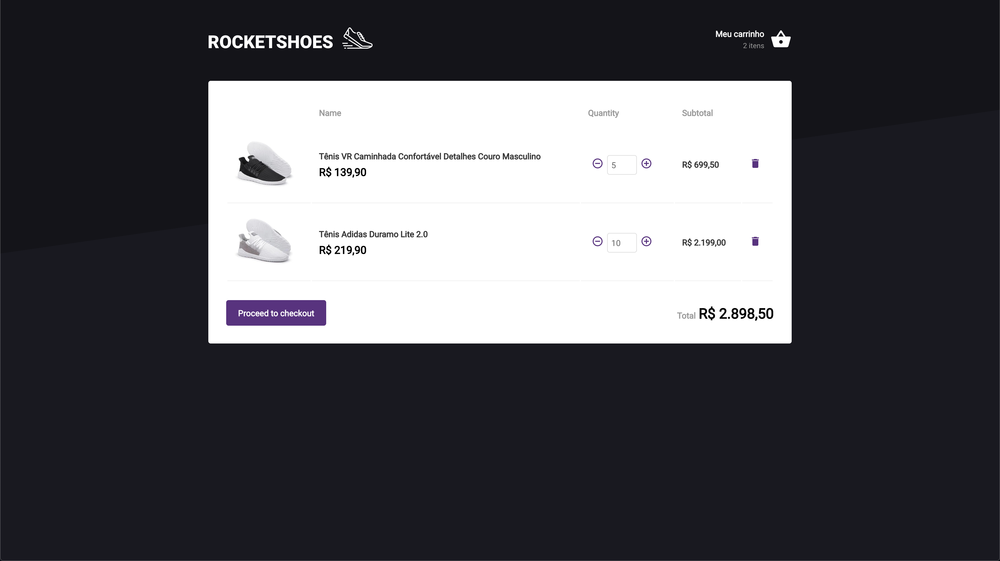

[![LinkedIn][linkedin-shield]][linkedin-url]

<p align="center">
  <h3 align="center">Rocketshoes</h3>

  <p align="center">
    A shoes e-commerce builded to practice Redux concepts
    <br />
  </p>
</p>

## Table of Contents

-   [About the Project](#about-the-project)
    -   [Built With](#built-with)
-   [Getting Started](#getting-started)
    -   [Prerequisites](#prerequisites)
    -   [Installation](#installation)
-   [Usage](#usage)
-   [Contact](#contact)
-   [Acknowledgements](#acknowledgements)

## About The Project




A shoes e-commerce, where there are a list of products at home page and you can add any product in your cart. So, after you have added all your choices in the cart, you go there and control the product quantity.

### Built With

-   [React](https://reactjs.org/)

## Getting Started

So, to get this project alive:

### Prerequisites

-   [yarn](https://yarnpkg.com/en/docs/install)

### Installation

1. Clone the repo

```sh
$ git clone https://github.com/kelvin-fernandes/bootcamp-rocketshoes.git
```

2. Install all application dependencies.

```sh
$ yarn
```

## Usage

Before you start the frontend, run this command to start a fake api

```sh
$ json-server server.json -p 3333
```

And finally.

```sh
$ yarn start
```

## Contact

Kelvin Fernandes - [@i4kelvin](https://instagram.com/i4mkelvin) - sokelvinfernandes@gmail.com

Project Link: [https://github.com/kelvin-fernandes/bootcamp-rocketshoes](https://github.com/kelvin-fernandes/bootcamp-rocketshoes)

## Acknowledgements

-   [Axios](github.com/axios/axios/) - Promise based HTTP client
-   [History](https://github.com/ReactTraining/history) - Manage session history with JavaScript
-   [Immer](https://github.com/immerjs/immer) - Create the next immutable state
-   [Polished](https://github.com/styled-components/polished) - A lightweight toolset for writing styles in JavaScript
-   [React Icons](https://github.com/react-icons/react-icons) - svg react icons of popular icon packs
-   [Redux](https://redux.js.org/) - A predictable state container for JavaScript apps
-   [React Toastify](https://github.com/fkhadra/react-toastify) - React notification made easy
-   [Redux Saga](https://redux-saga.js.org/) - Make application side effects easier to manage
-   [Prop Types](https://github.com/facebook/prop-types) - Runtime type checking for React props and similar objects
-   [Styled Components](https://github.com/styled-components/styled-components) - Visual primitives for the component age
-   [ESLint](eslint.org) - Linting utility for JavaScript
-   [Prettier](prettier.io) - Code formatter

[linkedin-shield]: https://img.shields.io/badge/-LinkedIn-black.svg?style=flat-square&logo=linkedin&colorB=1178B3
[linkedin-url]: https://linkedin.com/in/kelvin-fernandes
